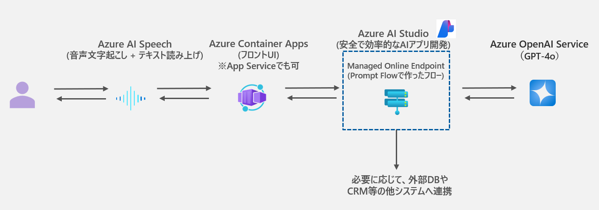
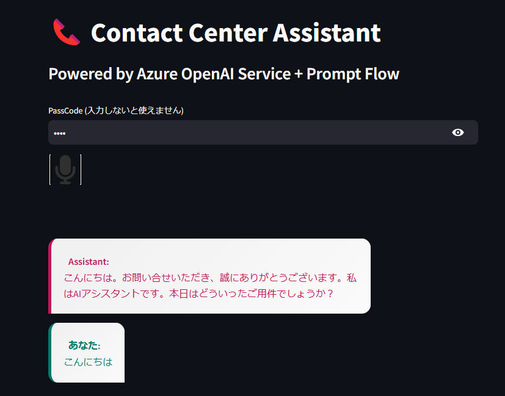
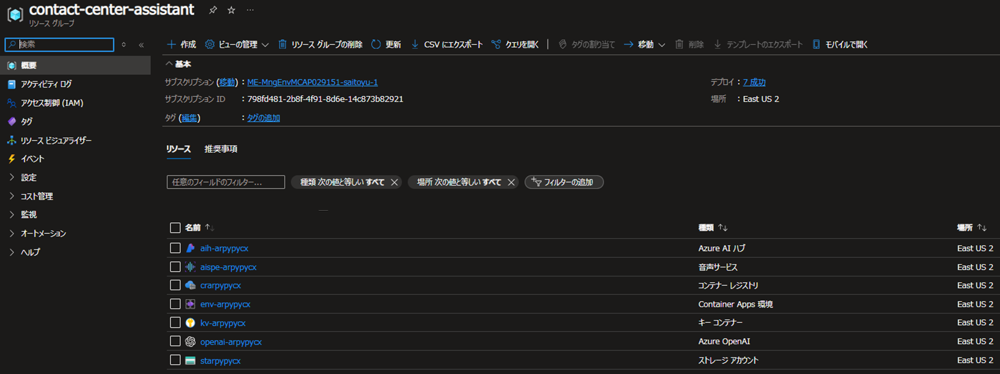

# contact-center-assistant
本リポジトリは、コンタクトセンターアシスタントのデモ用アプリケーションです。Bicep により IaC 化されているため、以下の手順で以下のアーキテクチャから構成されるアプリケーションをデプロイすることができます。




## デモ用アプリケーションについて
本リポジトリのアプリケーションをデプロイすると、以下のような画面のアプリケーションが起動します。



## 前提
本リポジトリでは、[Azure CLI](https://learn.microsoft.com/ja-jp/cli/azure/what-is-azure-cli) と [Azure Developer CLI](https://learn.microsoft.com/ja-jp/azure/developer/azure-developer-cli/overview) がインストール済みであるとします。

## デモアプリの利用までの流れ
1. Azure リソースのデプロイ
1. プロンプトフローの作成
1. アプリケーションのデプロイ
1. アプリケーションへのアクセス

## Azure リソースのデプロイ
以下のコマンドを実行し、ログインします。
```
azd auth login --tenant-id <TENANT_ID>
```
以下のコマンドを実行し、Azure リソースをデプロイします。以下のコマンドの実行時、以下の項目について問われます。
- 環境名の入力 (リソースグループ名にも使われます)
- サブスクリプションの選択
- リージョンの選択 (※)1
(デプロイには 5 分ほど時間がかかります。) (※2)
```
azd up
```

(**※1** 本アプリでは、Azure OpenAI Service の gpt-4o と whisper モデルをデプロイするため、両方デプロイ可能なリージョンを選択してください。2024/8 月現在、eastus2, northcentralus, swedencentral にて両方のモデルをデプロイすることが可能になっています。最新の情報は [Microsoft の公式ドキュメント](https://learn.microsoft.com/ja-jp/azure/ai-services/openai/concepts/models#standard-deployment-model-availability) をご確認下さい。)

(**※2** `RequestConflict: Cannot modify resource with id '/subscriptions/<subscription-id>/resourceGroups/<resource-group-name>/providers/Microsoft.CognitiveServices/accounts/<aoai-account-name>' because the resource entity provisioning state is not terminal. Please wait for the provisioning state to become terminal and then retry the request.` というエラーが出力されデプロイが止まってしまった場合は、数分時間をおいたのちに改めて azd up を実行してください。)

### Azure リソースのデプロイ結果
Azure リソースのデプロイ後、Azure ポータル画面にて以下のリソースが作成されていることが確認できます。



**注意** Azure Container Apps に関しては、後の手順でのアプリケーションのデプロイ時に合わせてデプロイを行うため、現時点では Azure Container Apps はデプロイされていません。

## プロンプトフローの作成
以下の手順に従い、プロンプトフローを作成します。
1. GitHub から [contact-center-assistant.zip](https://github.com/yus04/contact-center-assistant/blob/main/prompt-flow/contact-center-assistant.zip) をダウンロードする。
1. [Azure AI Studio](https://ai.azure.com/) を開く。
1. 新規のプロジェクトを作成する。
1. プロンプトフローの画面でローカルにある zip ファイルのアップロードを行う。
1. Azure OpenAI Service の接続情報を選択する。
1. エンドポイントのデプロイを行う。(※)

(※ エンドポイントのデプロイには 10 分程時間がかかります。)


## アプリケーションのデプロイ

### 環境変数ファイル (.env) を作成
- .env の作成には [.env.sample](https://github.com/yus04/contact-center-assistant/blob/main/app/.env.sample) を参考にするとよい。
- .env に記述する情報は Azure ポータルから取得する。

### コンテナアプリと Azure Container Apps のデプロイ
Azure ポータルのコンテナレジストリの画面から、コンテナレジストリの管理者になり、以下の情報を取得する。
```
- CONTAINER_REGISTRY_SERVER (形式：{container-registry-name}.azurecr.io)
- CONTAINER_REGISTRY_USERNAME (形式：{container-registry-name})
- CONTAINER_REGISTRY_PASSWORD (形式：xxxxxxxxx...xxxxxxxxx)
```

ログインしていない場合は、以下のコマンドを実行
```
az login --tenant <TENANT_ID>
```

app ディレクトリに移動する
```
cd path/to/app
```

コンテナアプリと Azure Container Apps をデプロイする
```
az containerapp up --name <CONTAINER_APPS_NAM> --resource-group <RESOURCE_GROUP> --environment <APP_ENVIRONMENT_NAME> --registry-server <CONTAINER_REGISTRY_SERVER> --registry-username <CONTAINER_REGISTRY_USERNAME> --registry-password <CONTAINER_REGISTRY_PASSWORD> --source . --ingress external --target-port 8501
```


## アプリケーションへのアクセス
Azure ポータルの Azure Container Apps の画面に表示されている 「アプリケーション URL」 からアプリケーションにアクセスします。デプロイのコマンドを実行してから、アクセス可能な状態になるには 5 分程度時間がかかります。